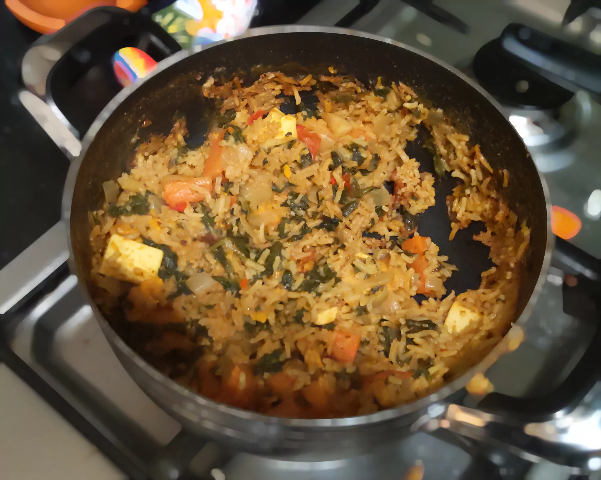

Halfy's Biryani
---------------
I wasn't satisifed with most of the veg biryani options out there so I ended up writing my own by combining some of them together.

## Ingredients
- Olive Oil
- One Diced Onion
- Ginger Paste
- 1-2 cloves garlic
- Cumin
- Curry Paste
- Rice
- Yogurt
- Fresh Coriander
- Vegetable Stock
- Cubed Paneer
- Chillies

## Steps
1. Cook the vegetables in a little oil, cumin and salt until just a little soft. Set aside (10 minutes)
1. Fry the onions on a medium heat for 10 minutes until soft (10 minutes)
1. Add the ginger paste, half the garlic and cook for a bit (1 minute)
1. Add the veg back and mix in the curry paste (90 seconds)
1. Add the rice, stock pot and hot water and bring to the boil (2 minutes)
1. Heat the oven to 180C
1. Stir in the paneer and spinach until just a little liquid is visible, and season.
1. Cover the dish with foil and then a lid. Cook in the oven for 20 minutes.
1. Take out from the oven and give it a stir, if some liquid remains then cook on the hob until it's still moist but not very wet.
1. Scatter coriander and chillies, and mix in some yougart.
1. Serve

## Sources
- https://www.bbcgoodfood.com/recipes/lamb-biryani
- https://www.bbcgoodfood.com/recipes/cheats-beetroot-biriyani
